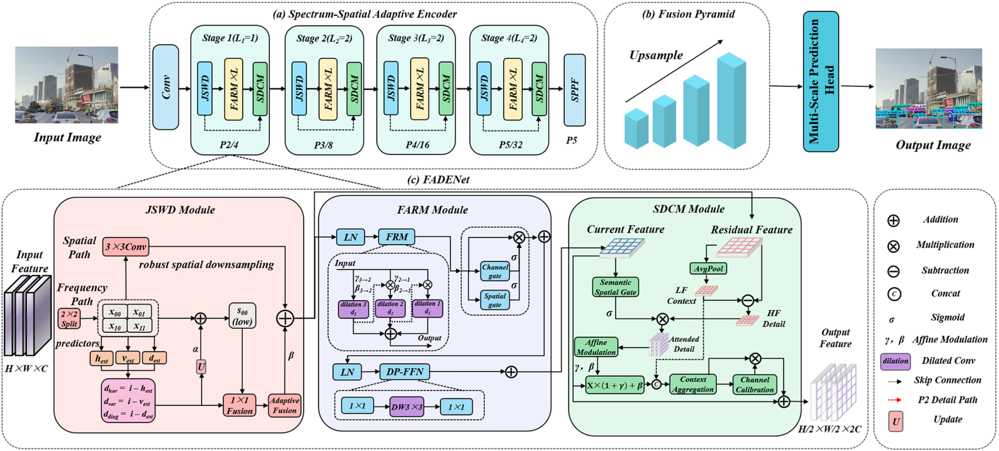

# FADENet: Frequency-Aware Detail Enhancement Network for Object Detection 

*[Author information pending]*

*[Affiliation / Institution pending]*

This is the PyTorch implementation of **FADENet: Frequency-Aware Detail Enhancement Network for Object Detection**. This document summarizes the method, environment requirements, repository layout, dataset preparation, pretrained weights, and commands for training and evaluation.

[](https://www.python.org/)
[](https://pytorch.org/)
[](LICENSE)

> The current manuscript still contains placeholder author and affiliation fields. Replace the two lines above before public release.

## Performance at a Glance

| Dataset | Precision | Recall | mAP50 | mAP50:95 | Params (M) |
|---|---:|---:|---:|---:|---:|
| M3FD | 0.816 | 0.616 | **0.711** | 0.439 | 3.86 |
| MFAD | 0.763 | 0.604 | 0.682 | **0.456** | 3.86 |

## Architecture



*Architecture and feature flow of FADENet. JSWD preserves and refines high-frequency details, FARM adaptively models multi-scale context, and SDCM enables bidirectional interaction between deep semantics and shallow details.*

FADENet jointly redesigns downsampling, feature evolution, and cross-scale fusion. Each stage begins with JSWD, applies stacked FARM blocks, and uses SDCM for semantic-detail interaction. The fusion pyramid retains a high-resolution P2 branch for small-object detection.

The main implementation is located in [`ultralytics/nn/modules/FADENet.py`](ultralytics/nn/modules/FADENet.py), and the detector is configured in [`ultralytics/cfg/models/11/FADENet.yaml`](ultralytics/cfg/models/11/FADENet.yaml).

## Requirements

- Python 3.10 (recommended)
- PyTorch 2.7 or later
- Torchvision 0.22 or later
- CUDA-compatible GPU (recommended for training)
- Additional packages declared in `pyproject.toml`

Create a clean environment:

```bash
conda create -n fadenet python=3.10 -y
conda activate fadenet
```

Install PyTorch for your hardware using the [official installation selector](https://pytorch.org/get-started/locally/). NVIDIA RTX 50-series GPUs use the Blackwell `sm_120` architecture and require a PyTorch build compiled with CUDA 12.8 or later. A compatible Windows/Linux installation is:

```bash
python -m pip install torch==2.7.1 torchvision==0.22.1 --index-url https://download.pytorch.org/whl/cu128
```

Install FADENet only after the correct PyTorch build is available:

```bash
python -m pip install -e .
```

CPU users and users of other GPU platforms should select the corresponding PyTorch build from the official selector.

### RTX 50-Series Troubleshooting

If training fails with the following error, the installed PyTorch binary does not contain kernels for the Blackwell GPU:

```text
CUDA error: no kernel image is available for execution on the device
```

Remove the incompatible build and reinstall the CUDA 12.8 build:

```bash
python -m pip uninstall -y torch torchvision torchaudio
python -m pip install torch==2.7.1 torchvision==0.22.1 --index-url https://download.pytorch.org/whl/cu128
```

## Repository Layout

```text
FADENet/
├── ultralytics/
│   ├── cfg/models/11/FADENet.yaml     # Model configuration
│   ├── models/yolo/detect/             # Detection training, validation, and inference
│   └── nn/modules/
│       ├── FADENet.py                  # Core FADENet modules
│       └── ssa_stage.py                # Legacy checkpoint compatibility
├── weights/
│   ├── M3FDbest.pt                     # M3FD pretrained checkpoint
│   └── MFADbest.pt                     # MFAD pretrained checkpoint
├── figures/
│   ├── FADE_Net_recolored.png          # Architecture figure
│   ├── detection.png                   # Detection visualization
│   └── heatmap.png                     # Heatmap visualization
├── data.yaml                            # M3FD dataset configuration
├── data_mfad.yaml                       # MFAD dataset configuration
├── train.py                             # Training entry point
├── val.py                               # Validation entry point
├── pyproject.toml                       # Dependencies and package metadata
```

## Dataset Preparation

The paper evaluates visible-spectrum images from M3FD and MFAD. Convert annotations to standard YOLO detection format and keep matching image and label stems.

```text
DATASET_ROOT/
├── images/
│   ├── train/
│   └── test/
└── labels/
    ├── train/
    └── test/
```

Each label file contains one object per line:

```text
class_id x_center y_center width height
```

Coordinates must be normalized to `[0, 1]`.

### M3FD

The paper uses 2,100 training images and 2,100 validation images. The six categories are `People`, `Car`, `Bus`, `Lamp`, `Motorcycle`, and `Truck`. Update the dataset paths in [`data.yaml`](data.yaml).

### MFAD

The paper uses 9,751 training images and 2,443 validation images. The six categories are `Car`, `Bus`, `Truck`, `Pedestrian`, `Ebikerider`, and `Cyclist`. Update the dataset paths in [`data_mfad.yaml`](data_mfad.yaml).

## Pretrained Weight

Place the released checkpoints under `weights/`:

| Dataset | Checkpoint | mAP50 | mAP50:95 |
|---|---|---:|---:|
| M3FD | `weights/M3FDbest.pt` | 0.711 | 0.439 |
| MFAD | `weights/MFADbest.pt` | 0.682 | 0.456 |

These checkpoints were produced before the main component was renamed to `FADENet`. Keep [`ultralytics/nn/modules/ssa_stage.py`](ultralytics/nn/modules/ssa_stage.py) so that existing `.pt` files can be deserialized.

For public distribution, upload large checkpoints through GitHub Releases or a model-hosting service instead of committing them directly to the repository.

## Training

The paper trains all models for 100 epochs on one NVIDIA RTX 3090 with batch size 8, 640×640 inputs, stochastic gradient descent, and no mixed-precision training.

Start training with:

```bash
python train.py
```

The released script uses 100 epochs, batch size 8, 640×640 inputs, and `amp=False`. To match the paper exactly, set `optimizer="SGD"` in [`train.py`](train.py); the current script uses automatic optimizer selection. Outputs are written to:

```text
FADENet_Experiments/
```

To train on MFAD, change the dataset configuration in `train.py`:

```python
dataset_yaml_path = project_dir / "data_mfad.yaml"
```

## Evaluation

### M3FD

```bash
python val.py --model weights/M3FDbest.pt --data data.yaml --batch 8
```

### MFAD

The default validation command uses `weights/MFADbest.pt` and `data_mfad.yaml`:

```bash
python val.py
```

The equivalent explicit command is:

```bash
python val.py --model weights/MFADbest.pt --data data_mfad.yaml --batch 8
```

## Inference

```python
from ultralytics import YOLO

model = YOLO("weights/MFADbest.pt", task="detect")
results = model.predict(source="path/to/image.jpg", imgsz=640, conf=0.25)
```

## Method

### Joint Spatial-Wavelet Downsampler

JSWD applies 2×2 space-to-depth slicing. Its spatial branch fuses the four submaps with a 3×3 convolution to retain pixel information. In parallel, directional predictors estimate high-frequency residuals from the low-frequency approximation. A learnable weight combines the low-loss spatial features with the refined frequency details.

### Frequency-Aware Routing and Modulation Block

FARM constructs three dilated-convolution branches with large, medium, and small receptive fields. Frequency-energy masks route smooth regions toward the large-receptive-field branch for global semantics and sharp structures toward the small-receptive-field branch for boundary localization. Cascaded modulation coordinates multi-scale context and fine details.

### Semantic-Detail Cross-Modulation

SDCM uses deep semantics to filter shallow high-frequency details and the refined details to sharpen deep boundaries. Context aggregation, channel calibration, and residual addition then fuse the modulated semantic feature with shallow low-frequency information.

## Citation

If this code is useful in your research, please cite the associated paper. Formal BibTeX metadata will be added after the author and publication information is finalized.

```bibtex
@article{fadenet,
  title={FADENet: Frequency-Aware Detail Enhancement Network for Object Detection},
  author={To be updated},
  year={To be updated}
}
```
